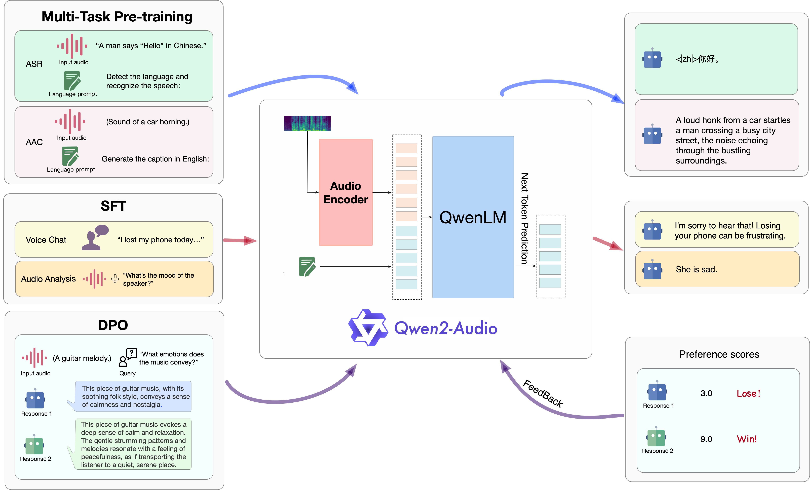
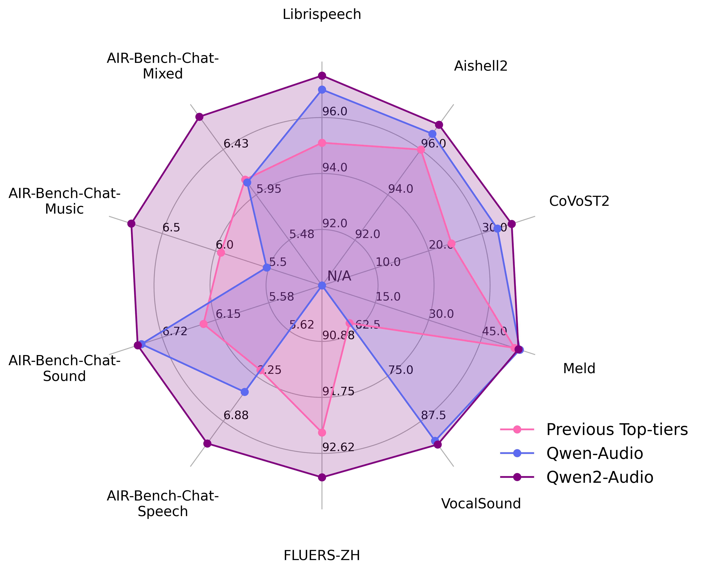

<p align="left">
        <a href="README_CN.md">中文</a> &nbsp｜ &nbsp English&nbsp&nbsp
</p>
<br><br>

<p align="center">
    
<p>

<p align="center">
Qwen2-Audio-7B <a href="https://modelscope.cn/models/qwen/Qwen2-Audio-7B">🤖 </a> | <a href="https://huggingface.co/Qwen/Qwen2-Audio-7B">🤗</a>&nbsp ｜ Qwen-Audio-7B-Instruct <a href="https://modelscope.cn/models/qwen/Qwen2-Audio-7B-Instruct">🤖 </a>| <a href="https://huggingface.co/Qwen/Qwen2-Audio-7B-Instruct">🤗</a>&nbsp ｜ Demo<a href="https://modelscope.cn/studios/qwen/Qwen2-Audio-Instruct-Demo"> 🤖</a> | <a href="https://huggingface.co/spaces/Qwen/Qwen2-Audio-Instruct-Demo">🤗</a>&nbsp
<br>
📑 <a href="https://arxiv.org/abs/2407.10759">Paper</a> &nbsp&nbsp | &nbsp&nbsp 📑 <a href="https://qwenlm.github.io/blog/qwen2-audio">Blog</a> &nbsp&nbsp | &nbsp&nbsp 💬 <a href="https://github.com/QwenLM/Qwen/blob/main/assets/wechat.png">WeChat (微信)</a>&nbsp&nbsp | &nbsp&nbsp <a href="https://discord.gg/CV4E9rpNSD">Discord</a>&nbsp&nbsp
</p>


We introduce the latest progress of Qwen-Audio, a large-scale audio-language model called Qwen2-Audio, which is capable of accepting various audio signal inputs and performing audio analysis or direct textual responses with regard to speech instructions. We introduce two distinct audio interaction modes:

* voice chat: users can freely engage in voice interactions with Qwen2-Audio without text input;
* audio analysis: users could provide audio and text instructions for analysis during the interaction;

**We've released two models of the Qwen2-Audio series: Qwen2-Audio-7B and Qwen2-Audio-7B-Instruct.**

## Architecture

The overview of three-stage training process of Qwen2-Audio.

<p align="center">
    
<p>

## News and Updates
* 2024.8.9 🎉 We released the checkpoints of both `Qwen2-Audio-7B` and `Qwen2-Audio-7B-Instruct` on ModelScope and Hugging Face.
* 2024.7.15 🎉 We released the paper of **Qwen2-Audio**, introducing the relevant model structure, training methods, and model performance. Check our [report](https://arxiv.org/abs/2407.10759) for details!
* 2023.11.30 🔥  We released the **Qwen-Audio** series.

<br>

## Evaluation
We evaluated the Qwen2-Audio's abilities on 13 standard benchmarks as follows:
<table><thead><tr><th>Task</th><th>Description</th><th>Dataset</th><th>Split</th><th>Metric</th></tr></thead><tbody><tr><td rowspan="4">ASR</td><td rowspan="4">Automatic Speech Recognition</td><td>Fleurs</td><td>dev | test</td><td rowspan="4">WER</td></tr><tr><td>Aishell2</td><td>test</td></tr><tr><td>Librispeech</td><td>dev | test</td></tr><tr><td>Common Voice</td><td>dev | test</td></tr><tr><td>S2TT</td><td>Speech-to-Text Translation</td><td>CoVoST2</td><td>test</td><td>BLEU </td></tr><tr><td>SER</td><td>Speech Emotion Recognition</td><td>Meld</td><td>test</td><td>ACC</td></tr><tr><td>VSC</td><td>Vocal Sound Classification</td><td>VocalSound</td><td>test</td><td>ACC</td></tr><tr><td rowspan="4"><a href="https://github.com/OFA-Sys/AIR-Bench">AIR-Bench</a><br></td><td>Chat-Benchmark-Speech</td><td>Fisher<br>SpokenWOZ<br>IEMOCAP<br>Common voice</td><td>dev | test</td><td>GPT-4 Eval</td></tr><tr><td>Chat-Benchmark-Sound</td><td>Clotho</td><td>dev | test</td><td>GPT-4 Eval</td></tr>
<tr><td>Chat-Benchmark-Music</td><td>MusicCaps</td><td>dev | test</td><td>GPT-4 Eval</td></tr><tr><td>Chat-Benchmark-Mixed-Audio</td><td>Common voice<br>AudioCaps<br>MusicCaps</td><td>dev | test</td><td>GPT-4 Eval</td></tr></tbody></table>


The below is the overal performance:
<p align="center">
    
<p>

The details of evaluation are as follows:
<br>
<b>(Note: The evaluation results we present are based on the initial model of the original training framework. However, the scores showed some fluctuations after converting the framework to Huggingface. Here, we present our complete evaluation results, starting with the initial model results from the paper.)</b>

<table><thead><tr><th rowspan="2">Task</th><th rowspan="2">Dataset</th><th rowspan="2">Model</th><th colspan="2">Performance</th></tr><tr><th>Metrics</th><th>Results</th></tr></thead><tbody><tr><td rowspan="15">ASR</td><td rowspan="7"><b>Librispeech</b><br>dev-clean | dev-other | <br>test-clean | test-other</td><td>SpeechT5</td><td rowspan="7">WER </td><td>2.1 | 5.5 | 2.4 | 5.8</td></tr><tr><td>SpeechNet</td><td>- | - | 30.7 | -</td></tr><tr><td>SLM-FT</td><td>- | - | 2.6 | 5.0</td></tr><tr><td>SALMONN</td><td>- | - | 2.1 | 4.9</td></tr><tr><td>SpeechVerse</td><td>- | - | 2.1 | 4.4</td></tr><tr><td>Qwen-Audio</td><td>1.8 | 4.0 | 2.0 | 4.2</td></tr><tr><td>Qwen2-Audio</td><td><b>1.3 | 3.4 | 1.6 | 3.6</b></td></tr><tr><td rowspan="2"><b>Common Voice 15</b> <br>en | zh | yue | fr</td><td>Whisper-large-v3</td><td rowspan="2">WER </td><td>9.3 | 12.8 | 10.9 | 10.8</td></tr><tr><td>Qwen2-Audio</td><td><b>8.6 | 6.9 | 5.9 | 9.6</b></td></tr>
<tr><td rowspan="2"><b>Fleurs</b> <br>zh</td><td>Whisper-large-v3</td><td rowspan="2">WER </td><td>7.7</td></tr><tr><td>Qwen2-Audio</td><td><b>7.5</b></td></tr><tr><td rowspan="4"><b>Aishell2</b> <br>Mic | iOS | Android</td><td>MMSpeech-base</td><td rowspan="4">WER </td><td>4.5 | 3.9 | 4.0</td></tr><tr><td>Paraformer-large</td><td>- | <b>2.9</b> | -</td></tr><tr><td>Qwen-Audio</td><td>3.3 | 3.1 | 3.3</td></tr><tr><td>Qwen2-Audio</td><td><b>3.0</b> | 3.0 | <b>2.9</b></td></tr><tr><td rowspan="8">S2TT</td><td rowspan="5"><b>CoVoST2</b> <br>en-de | de-en | <br>en-zh | zh-en</td><td>SALMONN</td><td rowspan="5">BLEU </td><td>18.6 | - | 33.1 | -</td></tr><tr><td>SpeechLLaMA</td><td>- | 27.1 | - | 12.3</td></tr><tr><td>BLSP</td><td>14.1 | - | - | -</td></tr><tr><td>Qwen-Audio</td><td>25.1 | 33.9 | 41.5 | 15.7</td></tr><tr><td>Qwen2-Audio</td><td><b>29.9 | 35.2 | 45.2 | 24.4</b></td></tr>
<tr><td rowspan="3"><b>CoVoST2</b> <br>es-en | fr-en | it-en |</td><td>SpeechLLaMA</td><td rowspan="3">BLEU </td><td>27.9 | 25.2 | 25.9</td></tr><tr><td>Qwen-Audio</td><td>39.7 | <b>38.5</b> | 36.0</td></tr><tr><td>Qwen2-Audio</td><td><b>40.0 | 38.5 | 36.3</b></td></tr><tr><td rowspan="3">SER</td><td rowspan="3"><b>Meld</b></td><td>WavLM-large</td><td rowspan="3">ACC </td><td>0.542</td></tr><tr><td>Qwen-Audio</td><td><b>0.557</b></td></tr><tr><td>Qwen2-Audio</td><td>0.553</td></tr><tr><td rowspan="4">VSC</td><td rowspan="4"><b>VocalSound</b></td><td>CLAP</td><td rowspan="4">ACC </td><td>0.4945</td></tr><tr><td>Pengi</td><td>0.6035</td></tr><tr><td>Qwen-Audio</td><td>0.9289</td></tr><tr><td>Qwen2-Audio</td><td><b>0.9392</b></td></tr>
<tr><td>AIR-Bench <br></td><td><b>Chat Benchmark</b><br>Speech | Sound |<br> Music | Mixed-Audio</td><td>SALMONN<br>BLSP<br>Pandagpt<br>Macaw-LLM<br>SpeechGPT<br>Next-gpt<br>Qwen-Audio<br>Gemini-1.5-pro<br>Qwen2-Audio</td><td>GPT-4 </td><td>6.16 | 6.28 | 5.95 | 6.08<br>6.17 | 5.55 | 5.08 | 5.33<br>3.58 | 5.46 | 5.06 | 4.25<br>0.97 | 1.01 | 0.91 | 1.01<br>1.57 | 0.95 | 0.95 | 4.13<br>3.86 | 4.76 | 4.18 | 4.13<br>6.47 | 6.95 | 5.52 | 6.08<br>6.97 | 5.49 | 5.06 | 5.27<br><b>7.18 | 6.99 | 6.79 | 6.77</b></td></tr></tbody></table>

<b>(Second is after converting huggingface)</b>

<table><thead><tr><th rowspan="2">Task</th><th rowspan="2">Dataset</th><th rowspan="2">Model</th><th colspan="2">Performance</th></tr><tr><th>Metrics</th><th>Results</th></tr></thead><tbody><tr><td rowspan="15">ASR</td><td rowspan="7"><b>Librispeech</b><br>dev-clean | dev-other | <br>test-clean | test-other</td><td>SpeechT5</td><td rowspan="7">WER </td><td>2.1 | 5.5 | 2.4 | 5.8</td></tr><tr><td>SpeechNet</td><td>- | - | 30.7 | -</td></tr><tr><td>SLM-FT</td><td>- | - | 2.6 | 5.0</td></tr><tr><td>SALMONN</td><td>- | - | 2.1 | 4.9</td></tr><tr><td>SpeechVerse</td><td>- | - | 2.1 | 4.4</td></tr><tr><td>Qwen-Audio</td><td>1.8 | 4.0 | 2.0 | 4.2</td></tr><tr><td>Qwen2-Audio</td><td><b>1.7 | 3.6 | 1.7 | 4.0</b></td></tr><tr><td rowspan="2"><b>Common Voice 15</b> <br>en | zh | yue | fr</td><td>Whisper-large-v3</td><td rowspan="2">WER </td><td>9.3 | 12.8 | 10.9 | 10.8</td></tr><tr><td>Qwen2-Audio</td><td><b>8.7 | 6.5 | 5.9 | 9.6</b></td></tr>
<tr><td rowspan="2"><b>Fleurs</b> <br>zh</td><td>Whisper-large-v3</td><td rowspan="2">WER </td><td>7.7</td></tr><tr><td>Qwen2-Audio</td><td><b>7.0</b></td></tr><tr><td rowspan="4"><b>Aishell2</b> <br>Mic | iOS | Android</td><td>MMSpeech-base</td><td rowspan="4">WER </td><td>4.5 | 3.9 | 4.0</td></tr><tr><td>Paraformer-large</td><td>- | <b>2.9</b> | -</td></tr><tr><td>Qwen-Audio</td><td>3.3 | 3.1 | 3.3</td></tr><tr><td>Qwen2-Audio</td><td><b>3.2</b> | 3.1 | <b>2.9</b></td></tr><tr><td rowspan="8">S2TT</td><td rowspan="5"><b>CoVoST2</b> <br>en-de | de-en | <br>en-zh | zh-en</td><td>SALMONN</td><td rowspan="5">BLEU </td><td>18.6 | - | 33.1 | -</td></tr><tr><td>SpeechLLaMA</td><td>- | 27.1 | - | 12.3</td></tr><tr><td>BLSP</td><td>14.1 | - | - | -</td></tr><tr><td>Qwen-Audio</td><td>25.1 | <b>33.9</b> | 41.5 | 15.7</td></tr><tr><td>Qwen2-Audio</td><td><b>29.6</b> | 33.6 | <b>45.6</b> | <b>24.0</b></td></tr>
<tr><td rowspan="3"><b>CoVoST2</b> <br>es-en | fr-en | it-en |</td><td>SpeechLLaMA</td><td rowspan="3">BLEU </td><td>27.9 | 25.2 | 25.9</td></tr><tr><td>Qwen-Audio</td><td><b>39.7 | 38.5 | 36.0</b></td></tr><tr><td>Qwen2-Audio</td><td>38.7 | 37.2 | 35.2</td></tr><tr><td rowspan="3">SER</td><td rowspan="3"><b>Meld</b></td><td>WavLM-large</td><td rowspan="3">ACC </td><td>0.542</td></tr><tr><td>Qwen-Audio</td><td><b>0.557</b></td></tr><tr><td>Qwen2-Audio</td><td>0.535</td></tr><tr><td rowspan="4">VSC</td><td rowspan="4"><b>VocalSound</b></td><td>CLAP</td><td rowspan="4">ACC </td><td>0.4945</td></tr><tr><td>Pengi</td><td>0.6035</td></tr><tr><td>Qwen-Audio</td><td>0.9289</td></tr><tr><td>Qwen2-Audio</td><td><b>0.9395</b></td></tr>
<tr><td>AIR-Bench <br></td><td><b>Chat Benchmark</b><br>Speech | Sound |<br> Music | Mixed-Audio</td><td>SALMONN<br>BLSP<br>Pandagpt<br>Macaw-LLM<br>SpeechGPT<br>Next-gpt<br>Qwen-Audio<br>Gemini-1.5-pro<br>Qwen2-Audio</td><td>GPT-4 </td><td>6.16 | 6.28 | 5.95 | 6.08<br>6.17 | 5.55 | 5.08 | 5.33<br>3.58 | 5.46 | 5.06 | 4.25<br>0.97 | 1.01 | 0.91 | 1.01<br>1.57 | 0.95 | 0.95 | 4.13<br>3.86 | 4.76 | 4.18 | 4.13<br>6.47 | <b>6.95</b> | 5.52 | 6.08<br>6.97 | 5.49 | 5.06 | 5.27<br><b>7.24</b> | 6.83 | <b>6.73</b> | <b>6.42</b></td></tr></tbody></table>


We have provided **all** evaluation scripts to reproduce our results. Please refer to [eval_audio/EVALUATION.md](eval_audio/EVALUATION.md) for details.

## Requirements
The code of Qwen2-Audio has been in the latest Hugging face transformers and we advise you to build from source with command `pip install git+https://github.com/huggingface/transformers`, or you might encounter the following error:
```
KeyError: 'qwen2-audio'
```

## Quickstart
Below, we provide simple examples to show how to use Qwen2-Audio and Qwen2-Audio-Instruct with 🤗 Transformers.
Before running the code, make sure you have setup the environment and installed the required packages. Make sure you meet the above requirements, and then install the dependent libraries.
Now you can start with ModelScope or Transformers. Qwen2-Audio models currently perform best with audio clips under 30 seconds.
#### 🤗 Transformers
In the following, we demonstrate how to use `Qwen2-Audio-7B-Instruct` for the inference, supporting both voice chat and audio analysis modes. Note that we have used the ChatML format for dialog, in this demo we show how to leverage `apply_chat_template` for this purpose.

##### Voice Chat Inference
In the voice chat mode, users can freely engage in voice interactions with Qwen2-Audio without text input:
```python
from io import BytesIO
from urllib.request import urlopen
import librosa
from transformers import Qwen2AudioForConditionalGeneration, Qwen2AudioProcessor

processor = Qwen2AudioProcessor.from_pretrained("Qwen/Qwen2-Audio-7B-Instruct")
model = Qwen2AudioForConditionalGeneration.from_pretrained("Qwen/Qwen2-Audio-7B-Instruct", device_map="auto")

conversation = [
    {"role": "user", "content": [
        {"type": "audio", "audio": "your_path/guess_age_gender.wav"},
    ]},
    {"role": "assistant", "content": "Yes, the speaker is female and in her twenties."},
    {"role": "user", "content": [
        {"type": "audio", "audio_url": "https://qianwen-res.oss-cn-beijing.aliyuncs.com/Qwen2-Audio/audio/translate_to_chinese.wav"},
    ]},
]
text = processor.apply_chat_template(conversation,chat_template = processor.default_chat_template, add_generation_prompt=True, tokenize=False)
audios = []
for message in conversation:
    if isinstance(message["content"], list):
        for ele in message["content"]:
            if ele["type"] == "audio":
                if "audio_url" in ele:
                    audios.append(librosa.load(
                        BytesIO(urlopen(ele['audio_url']).read()), 
                        sr=processor.feature_extractor.sampling_rate)[0]
                    )
                elif "audio" in ele:
                    audios.append(
                        librosa.load(ele['audio'], sr=processor.feature_extractor.sampling_rate)[0]
                    )

inputs = processor(text=text, audios=audios, return_tensors="pt", padding=True)
inputs.input_ids = inputs.input_ids.to("cuda")

generate_ids = model.generate(**inputs, max_length=256)
generate_ids = generate_ids[:, inputs.input_ids.size(1):]

response = processor.batch_decode(generate_ids, skip_special_tokens=True, clean_up_tokenization_spaces=False)[0]
```

##### Audio Analysis Inference
In the audio analysis, users could provide both audio and text instructions for analysis:
```python
from io import BytesIO
from urllib.request import urlopen
import librosa
from transformers import Qwen2AudioForConditionalGeneration, Qwen2AudioProcessor

processor = Qwen2AudioProcessor.from_pretrained("Qwen/Qwen2-Audio-7B-Instruct")
model = Qwen2AudioForConditionalGeneration.from_pretrained("Qwen/Qwen2-Audio-7B-Instruct", device_map="auto")

conversation = [
    {'role': 'system', 'content': 'You are a helpful assistant.'}, 
    {"role": "user", "content": [
        {"type": "audio", "audio": "your_path/glass-breaking-151256.mp3"},
        {"type": "text", "text": "What's that sound?"},
    ]},
    {"role": "assistant", "content": "It is the sound of glass shattering."},
    {"role": "user", "content": [
        {"type": "text", "text": "What can you do when you hear that?"},
    ]},
    {"role": "assistant", "content": "Stay alert and cautious, and check if anyone is hurt or if there is any damage to property."},
    {"role": "user", "content": [
        {"type": "audio", "audio_url": "https://qianwen-res.oss-cn-beijing.aliyuncs.com/Qwen2-Audio/audio/1272-128104-0000.flac"},
        {"type": "text", "text": "What does the person say?"},
    ]},
]
text = processor.apply_chat_template(conversation, chat_template = processor.default_chat_template,add_generation_prompt=True, tokenize=False)
audios = []
for message in conversation:
    if isinstance(message["content"], list):
        for ele in message["content"]:
            if ele["type"] == "audio":
                if "audio_url" in ele:
                    audios.append(librosa.load(
                        BytesIO(urlopen(ele['audio_url']).read()), 
                        sr=processor.feature_extractor.sampling_rate)[0]
                    )
                elif "audio" in ele:
                    audios.append(
                        librosa.load(ele['audio'], sr=processor.feature_extractor.sampling_rate)[0]
                    )

inputs = processor(text=text, audios=audios, return_tensors="pt", padding=True)
inputs.input_ids = inputs.input_ids.to("cuda")

generate_ids = model.generate(**inputs, max_length=256)
generate_ids = generate_ids[:, inputs.input_ids.size(1):]

response = processor.batch_decode(generate_ids, skip_special_tokens=True, clean_up_tokenization_spaces=False)[0]
```

##### Batch Inference
We also support batch inference:
```python
from io import BytesIO
from urllib.request import urlopen
import librosa
from transformers import Qwen2AudioForConditionalGeneration, Qwen2AudioProcessor

processor = Qwen2AudioProcessor.from_pretrained("Qwen/Qwen2-Audio-7B-Instruct")
model = Qwen2AudioForConditionalGeneration.from_pretrained("Qwen/Qwen2-Audio-7B-Instruct", device_map="auto")

conversation1 = [
    {"role": "user", "content": [
        {"type": "audio", "audio": "your_path/glass-breaking-151256.mp3"},
        {"type": "text", "text": "What's that sound?"},
    ]},
    {"role": "assistant", "content": "It is the sound of glass shattering."},
    {"role": "user", "content": [
        {"type": "audio", "audio_url": "https://qianwen-res.oss-cn-beijing.aliyuncs.com/Qwen2-Audio/audio/f2641_0_throatclearing.wav"},
        {"type": "text", "text": "What can you hear?"},
    ]}
]

conversation2 = [
    {"role": "user", "content": [
        {"type": "audio", "audio_url": "https://qianwen-res.oss-cn-beijing.aliyuncs.com/Qwen2-Audio/audio/1272-128104-0000.flac"},
        {"type": "text", "text": "What does the person say?"},
    ]},
]

conversations = [conversation1, conversation2]

text = [processor.apply_chat_template(conversation, chat_template = processor.default_chat_template,add_generation_prompt=True, tokenize=False) for conversation in conversations]

audios = []
for conversation in conversations:
    for message in conversation:
        if isinstance(message["content"], list):
            for ele in message["content"]:
                if "audio_url" in ele:
                    audios.append(librosa.load(
                        BytesIO(urlopen(ele['audio_url']).read()), 
                        sr=processor.feature_extractor.sampling_rate)[0]
                    )
                elif "audio" in ele:
                    audios.append(
                        librosa.load(ele['audio'], sr=processor.feature_extractor.sampling_rate)[0]
                    )

inputs = processor(text=text, audios=audios, return_tensors="pt", padding=True)
inputs['input_ids'] = inputs['input_ids'].to("cuda")
inputs.input_ids = inputs.input_ids.to("cuda")

generate_ids = model.generate(**inputs, max_length=256)
generate_ids = generate_ids[:, inputs.input_ids.size(1):]

response = processor.batch_decode(generate_ids, skip_special_tokens=True, clean_up_tokenization_spaces=False)
```
Running Qwen2-Audio pretrained base model is also simple.
```python
from io import BytesIO
from urllib.request import urlopen
import librosa
from transformers import Qwen2AudioProcessor, Qwen2AudioForConditionalGeneration

model = Qwen2AudioForConditionalGeneration.from_pretrained("Qwen/Qwen2-Audio-7B" ,trust_remote_code=True)
processor = Qwen2AudioProcessor.from_pretrained("Qwen/Qwen2-Audio-7B" ,trust_remote_code=True)

prompt = "<|audio_bos|><|AUDIO|><|audio_eos|>Generate the caption in English:"
url = "https://qianwen-res.oss-cn-beijing.aliyuncs.com/Qwen-Audio/glass-breaking-151256.mp3"
audio, sr = librosa.load(BytesIO(urlopen(url).read()), sr=processor.feature_extractor.sampling_rate)
inputs = processor(text=prompt, audios=audio, return_tensors="pt")

generated_ids = model.generate(**inputs, max_length=256)
generated_ids = generated_ids[:, inputs.input_ids.size(1):]
response = processor.batch_decode(generated_ids, skip_special_tokens=True, clean_up_tokenization_spaces=False)[0]
```
#### 🤖 ModelScope
We strongly advise users especially those in mainland China to use ModelScope. `snapshot_download` can help you solve issues concerning downloading checkpoints.
## Demo
### Web UI
We provide code for users to build a web UI demo. Before you start, make sure you install the following packages:
```
pip install -r requirements_web_demo.txt
```
Then run the command below and click on the generated link:
```
python demo/web_demo_audio.py
```
<br>

## demos 
More impressive cases will be updated on our blog at [Qwen's blog](https://qwenlm.github.io/blog/qwen2-audio).

## We Are Hiring

If you are interested in joining us as full-time or intern, please contact us at `qwen_audio@list.alibaba-inc.com`.
<br>

## License Agreement

Check the license of each model inside its HF repo. It is NOT necessary for you to submit a request for commercial usage.
<br>

## Citation

If you find our paper and code useful in your research, please consider giving a star :star: and citation :pencil: :)

```BibTeX
@article{Qwen-Audio,
  title={Qwen-Audio: Advancing Universal Audio Understanding via Unified Large-Scale Audio-Language Models},
  author={Chu, Yunfei and Xu, Jin and Zhou, Xiaohuan and Yang, Qian and Zhang, Shiliang and Yan, Zhijie  and Zhou, Chang and Zhou, Jingren},
  journal={arXiv preprint arXiv:2311.07919},
  year={2023}
}
```

```BibTeX
@article{Qwen2-Audio,
  title={Qwen2-Audio Technical Report},
  author={Chu, Yunfei and Xu, Jin and Yang, Qian and Wei, Haojie and Wei, Xipin and Guo,  Zhifang and Leng, Yichong and Lv, Yuanjun and He, Jinzheng and Lin, Junyang and Zhou, Chang and Zhou, Jingren},
  journal={arXiv preprint arXiv:2407.10759},
  year={2024}
}
```
<br>

## Contact Us

If you are interested to leave a message to either our research team or product team, feel free to send an email to `qianwen_opensource@alibabacloud.com`.

