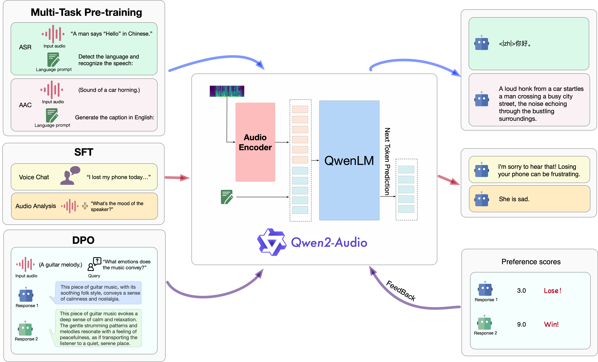
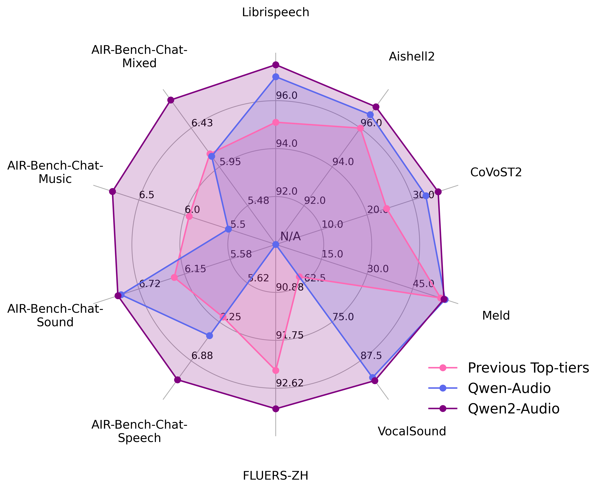

<p align="left">
        中文</a>&nbsp ｜ &nbsp<a href="README.md">English</a> &nbsp｜ &nbsp <a href="README_JP.md">日本語</a>
</p>
<br><br>

<p align="center">
    
<p>

<p align="center">
<br>
<a href="https://qwenlm.github.io/blog/">Blog</a>&nbsp&nbsp| &nbsp&nbsp<a href="https://arxiv.org/abs/2407.10759">Paper</a>&nbsp&nbsp | &nbsp&nbsp&nbsp<a href="https://github.com/QwenLM/Qwen/blob/main/assets/wechat.png">WeChat</a>&nbsp&nbsp | &nbsp&nbsp<a href="https://discord.gg/CV4E9rpNSD">Discord</a>&nbsp&nbsp</a>
</p>
<br><br>


我们介绍Qwen-Audio的最新进展：Qwen2-Audio。作为一个大规模音频语言模型，Qwen2-Audio能够接受各种音频信号输入，并根据语音指令执行音频分析或直接响应文本。我们介绍两种不同的音频交互模式：语音聊天voice chat和音频分析audio analysis。

* 语音聊天：用户可以自由地与Qwen2-Audio进行语音互动，而无需文本输入；
* 音频分析：用户可以在互动过程中提供音频和文本指令对音频进行分析；

**我们即将开源 Qwen2-Audio 系列的两个模型：Qwen2-Audio和Qwen2-Audio-Instruct，敬请期待。**
## 结构与训练范式

Qwen2-Audio三阶段训练过程概述。

<p align="left">
    
<p>


## 新闻
* 2024.7.15 🎉 我们发布了Qwen2-Audio的[论文](https://arxiv.org/abs/2407.10759), 介绍了相关的模型结构，训练方法和模型表现。
* 2023.11.30 🔥 我们发布了**Qwen-Audio**系列
<br>

## 评测
我们在标准的13个学术数据集上评测了模型的能力如下：

<table><thead><tr><th>Task</th><th>Description</th><th>Dataset</th><th>Split</th><th>Metric</th></tr></thead><tbody><tr><td rowspan="4">ASR</td><td rowspan="4">Automatic Speech Recognition</td><td>Fleurs</td><td>dev | test</td><td rowspan="4">WER</td></tr><tr><td>Aishell2</td><td>test</td></tr><tr><td>Librispeech</td><td>dev | test</td></tr><tr><td>Common Voice</td><td>dev | test</td></tr><tr><td>S2TT</td><td>Speech-to-Text Translation</td><td>CoVoST2</td><td>test</td><td>BLEU </td></tr><tr><td>SER</td><td>Speech Emotion Recognition</td><td>Meld</td><td>test</td><td>ACC</td></tr><tr><td>VSC</td><td>Vocal Sound Classification</td><td>VocalSound</td><td>test</td><td>ACC</td></tr><tr><td rowspan="4">AIR-Bench<br></td><td>Chat-Benchmark-Speech</td><td>Fisher<br>SpokenWOZ<br>IEMOCAP<br>Common voice</td><td>dev | test</td><td>GPT-4 Eval</td></tr><tr><td>Chat-Benchmark-Sound</td><td>Clotho</td><td>dev | test</td><td>GPT-4 Eval</td></tr>
<tr><td>Chat-Benchmark-Music</td><td>MusicCaps</td><td>dev | test</td><td>GPT-4 Eval</td></tr><tr><td>Chat-Benchmark-Mixed-Audio</td><td>Common voice<br>AudioCaps<br>MusicCaps</td><td>dev | test</td><td>GPT-4 Eval</td></tr></tbody></table>


以下是整体表现：
<p align="left">
    
<p>


评测分数详情如下：
<br>
<b>（注意：我们所展示的评测结果是在原始训练框架的初始模型上的，然而在框架转换Huggingface后指标出现了下滑，在这里我们展示我们的全部测评结果：首先是论文中的初始模型结果）</b>

<table><thead><tr><th rowspan="2">Task</th><th rowspan="2">Dataset</th><th rowspan="2">Model</th><th colspan="2">Performance</th></tr><tr><th>Metrics</th><th>Results</th></tr></thead><tbody><tr><td rowspan="15">ASR</td><td rowspan="7"><b>Librispeech</b><br>dev-clean | dev-other | <br>test-clean | test-other</td><td>SpeechT5</td><td rowspan="7">WER </td><td>2.1 | 5.5 | 2.4 | 5.8</td></tr><tr><td>SpeechNet</td><td>- | - | 30.7 | -</td></tr><tr><td>SLM-FT</td><td>- | - | 2.6 | 5.0</td></tr><tr><td>SALMONN</td><td>- | - | 2.1 | 4.9</td></tr><tr><td>SpeechVerse</td><td>- | - | 2.1 | 4.4</td></tr><tr><td>Qwen-Audio</td><td>1.8 | 4.0 | 2.0 | 4.2</td></tr><tr><td>Qwen2-Audio</td><td><b>1.3 | 3.4 | 1.6 | 3.6</b></td></tr><tr><td rowspan="2"><b>Common Voice 15</b> <br>en | zh | yue | fr</td><td>Whisper-large-v3</td><td rowspan="2">WER </td><td>9.3 | 12.8 | 10.9 | 10.8</td></tr><tr><td>Qwen2-Audio</td><td><b>8.6 | 6.9 | 5.9 | 9.6</b></td></tr>
<tr><td rowspan="2"><b>Fleurs</b> <br>zh</td><td>Whisper-large-v3</td><td rowspan="2">WER </td><td>7.7</td></tr><tr><td>Qwen2-Audio</td><td><b>7.5</b></td></tr><tr><td rowspan="4"><b>Aishell2</b> <br>Mic | iOS | Android</td><td>MMSpeech-base</td><td rowspan="4">WER </td><td>4.5 | 3.9 | 4.0</td></tr><tr><td>Paraformer-large</td><td>- | <b>2.9</b> | -</td></tr><tr><td>Qwen-Audio</td><td>3.3 | 3.1 | 3.3</td></tr><tr><td>Qwen2-Audio</td><td><b>3.0</b> | 3.0 | <b>2.9</b></td></tr><tr><td rowspan="8">S2TT</td><td rowspan="5"><b>CoVoST2</b> <br>en-de | de-en | <br>en-zh | zh-en</td><td>SALMONN</td><td rowspan="5">BLEU </td><td>18.6 | - | 33.1 | -</td></tr><tr><td>SpeechLLaMA</td><td>- | 27.1 | - | 12.3</td></tr><tr><td>BLSP</td><td>14.1 | - | - | -</td></tr><tr><td>Qwen-Audio</td><td>25.1 | 33.9 | 41.5 | 15.7</td></tr><tr><td>Qwen2-Audio</td><td><b>29.9 | 35.2 | 45.2 | 24.4</b></td></tr>
<tr><td rowspan="3"><b>CoVoST2</b> <br>es-en | fr-en | it-en |</td><td>SpeechLLaMA</td><td rowspan="3">BLEU </td><td>27.9 | 25.2 | 25.9</td></tr><tr><td>Qwen-Audio</td><td>39.7 | <b>38.5</b> | 36.0</td></tr><tr><td>Qwen2-Audio</td><td><b>40.0 | 38.5 | 36.3</b></td></tr><tr><td rowspan="3">SER</td><td rowspan="3"><b>Meld</b></td><td>WavLM-large</td><td rowspan="3">ACC </td><td>0.542</td></tr><tr><td>Qwen-Audio</td><td><b>0.557</b></td></tr><tr><td>Qwen2-Audio</td><td>0.553</td></tr><tr><td rowspan="4">VSC</td><td rowspan="4"><b>VocalSound</b></td><td>CLAP</td><td rowspan="4">ACC </td><td>0.4945</td></tr><tr><td>Pengi</td><td>0.6035</td></tr><tr><td>Qwen-Audio</td><td>0.9289</td></tr><tr><td>Qwen2-Audio</td><td><b>0.9392</b></td></tr>
<tr><td>AIR-Bench <br></td><td><b>Chat Benchmark</b><br>Speech | Sound |<br> Music | Mixed-Audio</td><td>SALMONN<br>BLSP<br>Pandagpt<br>Macaw-LLM<br>SpeechGPT<br>Next-gpt<br>Qwen-Audio<br>Gemini-1.5-pro<br>Qwen2-Audio</td><td>GPT-4 </td><td>6.16 | 6.28 | 5.95 | 6.08<br>6.17 | 5.55 | 5.08 | 5.33<br>3.58 | 5.46 | 5.06 | 4.25<br>0.97 | 1.01 | 0.91 | 1.01<br>1.57 | 0.95 | 0.95 | 4.13<br>3.86 | 4.76 | 4.18 | 4.13<br>6.47 | 6.95 | 5.52 | 6.08<br>6.97 | 5.49 | 5.06 | 5.27<br><b>7.18 | 6.99 | 6.79 | 6.77</b></td></tr></tbody></table>

<b>（其次是转换huggingface后的）</b>

<table><thead><tr><th rowspan="2">Task</th><th rowspan="2">Dataset</th><th rowspan="2">Model</th><th colspan="2">Performance</th></tr><tr><th>Metrics</th><th>Results</th></tr></thead><tbody><tr><td rowspan="15">ASR</td><td rowspan="7"><b>Librispeech</b><br>dev-clean | dev-other | <br>test-clean | test-other</td><td>SpeechT5</td><td rowspan="7">WER </td><td>2.1 | 5.5 | 2.4 | 5.8</td></tr><tr><td>SpeechNet</td><td>- | - | 30.7 | -</td></tr><tr><td>SLM-FT</td><td>- | - | 2.6 | 5.0</td></tr><tr><td>SALMONN</td><td>- | - | 2.1 | 4.9</td></tr><tr><td>SpeechVerse</td><td>- | - | 2.1 | 4.4</td></tr><tr><td>Qwen-Audio</td><td>1.8 | 4.0 | 2.0 | 4.2</td></tr><tr><td>Qwen2-Audio</td><td><b>1.7 | 3.6 | 1.7 | 4.0</b></td></tr><tr><td rowspan="2"><b>Common Voice 15</b> <br>en | zh | yue | fr</td><td>Whisper-large-v3</td><td rowspan="2">WER </td><td>9.3 | 12.8 | 10.9 | 10.8</td></tr><tr><td>Qwen2-Audio</td><td><b>8.7 | 6.5 | 5.9 | 9.6</b></td></tr>
<tr><td rowspan="2"><b>Fleurs</b> <br>zh</td><td>Whisper-large-v3</td><td rowspan="2">WER </td><td>7.7</td></tr><tr><td>Qwen2-Audio</td><td><b>7.0</b></td></tr><tr><td rowspan="4"><b>Aishell2</b> <br>Mic | iOS | Android</td><td>MMSpeech-base</td><td rowspan="4">WER </td><td>4.5 | 3.9 | 4.0</td></tr><tr><td>Paraformer-large</td><td>- | <b>2.9</b> | -</td></tr><tr><td>Qwen-Audio</td><td>3.3 | 3.1 | 3.3</td></tr><tr><td>Qwen2-Audio</td><td><b>3.2</b> | 3.1 | <b>2.9</b></td></tr><tr><td rowspan="8">S2TT</td><td rowspan="5"><b>CoVoST2</b> <br>en-de | de-en | <br>en-zh | zh-en</td><td>SALMONN</td><td rowspan="5">BLEU </td><td>18.6 | - | 33.1 | -</td></tr><tr><td>SpeechLLaMA</td><td>- | 27.1 | - | 12.3</td></tr><tr><td>BLSP</td><td>14.1 | - | - | -</td></tr><tr><td>Qwen-Audio</td><td>25.1 | <b>33.9</b> | 41.5 | 15.7</td></tr><tr><td>Qwen2-Audio</td><td><b>29.6</b> | 33.6 | <b>45.6</b> | <b>24.0</b></td></tr>
<tr><td rowspan="3"><b>CoVoST2</b> <br>es-en | fr-en | it-en |</td><td>SpeechLLaMA</td><td rowspan="3">BLEU </td><td>27.9 | 25.2 | 25.9</td></tr><tr><td>Qwen-Audio</td><td><b>39.7 | 38.5 | 36.0</b></td></tr><tr><td>Qwen2-Audio</td><td>38.7 | 37.2 | 35.2</td></tr><tr><td rowspan="3">SER</td><td rowspan="3"><b>Meld</b></td><td>WavLM-large</td><td rowspan="3">ACC </td><td>0.542</td></tr><tr><td>Qwen-Audio</td><td><b>0.557</b></td></tr><tr><td>Qwen2-Audio</td><td>0.535</td></tr><tr><td rowspan="4">VSC</td><td rowspan="4"><b>VocalSound</b></td><td>CLAP</td><td rowspan="4">ACC </td><td>0.4945</td></tr><tr><td>Pengi</td><td>0.6035</td></tr><tr><td>Qwen-Audio</td><td>0.9289</td></tr><tr><td>Qwen2-Audio</td><td><b>0.9395</b></td></tr>
<tr><td>AIR-Bench <br></td><td><b>Chat Benchmark</b><br>Speech | Sound |<br> Music | Mixed-Audio</td><td>SALMONN<br>BLSP<br>Pandagpt<br>Macaw-LLM<br>SpeechGPT<br>Next-gpt<br>Qwen-Audio<br>Gemini-1.5-pro<br>Qwen2-Audio</td><td>GPT-4 </td><td>6.16 | 6.28 | 5.95 | 6.08<br>6.17 | 5.55 | 5.08 | 5.33<br>3.58 | 5.46 | 5.06 | 4.25<br>0.97 | 1.01 | 0.91 | 1.01<br>1.57 | 0.95 | 0.95 | 4.13<br>3.86 | 4.76 | 4.18 | 4.13<br>6.47 | <b>6.95</b> | 5.52 | 6.08<br>6.97 | 5.49 | 5.06 | 5.27<br><b>7.24</b> | 6.83 | <b>6.73</b> | <b>6.42</b></td></tr></tbody></table>


我们将提供所有**评估脚本**来重现我们的结果。我们将很快提供**Huggingface、ModelScope、Web UI**。
请等待几天，我们正在努力完成这一过程。

## 样例展示
更多样例将更新于[通义千问博客](https://qwenlm.github.io/blog/)中的Qwen2-Audio博客。

## 团队招聘

我们是通义千问语音多模态团队，致力于以通义千问为核心，拓展音频多模态理解和生成能力，实现自由灵活的音频交互。目前团队蓬勃发展中，如有意向实习或全职加入我们，请发送简历至qwen_audio@list.alibaba-inc.com.
<br>

## 使用协议

请查看每个模型在其 Hugging Face 仓库中的许可证。您无需提交商业使用申请。
<br>

## 联系我们

如果你想给我们的研发团队和产品团队留言，请通过邮件（qianwen_opensource@alibabacloud.com）联系我们。
<br>


## 引用

如果你觉得我们的论文和代码对你的研究有帮助，请考虑:star: 和引用 :pencil: :)

```BibTeX
@article{Qwen-Audio,
  title={Qwen-Audio: Advancing Universal Audio Understanding via Unified Large-Scale Audio-Language Models},
  author={Chu, Yunfei and Xu, Jin and Zhou, Xiaohuan and Yang, Qian and Zhang, Shiliang and Yan, Zhijie  and Zhou, Chang and Zhou, Jingren},
  journal={arXiv preprint arXiv:2311.07919},
  year={2023}
}
```

```BibTeX
@article{Qwen2-Audio,
  title={Qwen2-Audio Technical Report},
  author={Chu, Yunfei and Xu, Jin and Yang, Qian and Wei, Haojie and Wei, Xipin and Guo,  Zhifang and Leng, Yichong and Lv, Yuanjun and He, Jinzheng and Lin, Junyang and Zhou, Chang and Zhou, Jingren},
  journal={arXiv preprint arXiv:2407.10759},
  year={2024}
}
```

